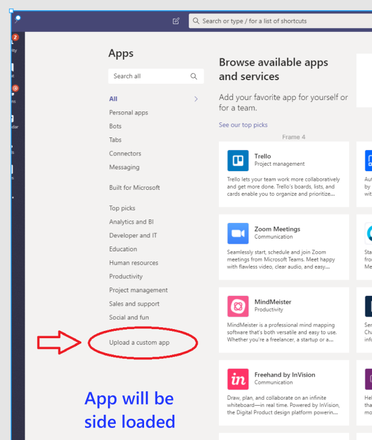
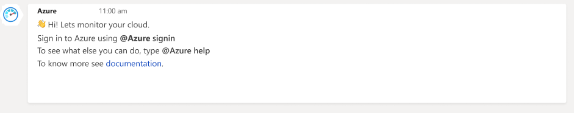
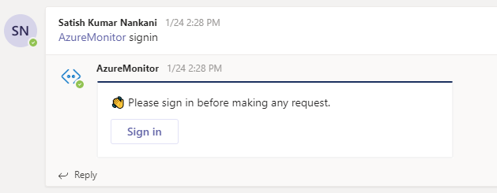
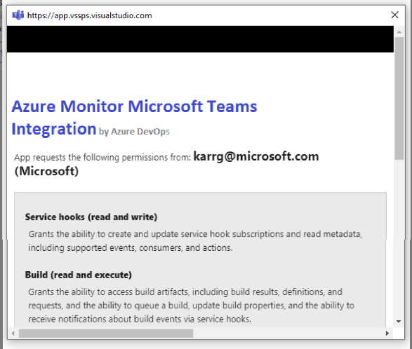
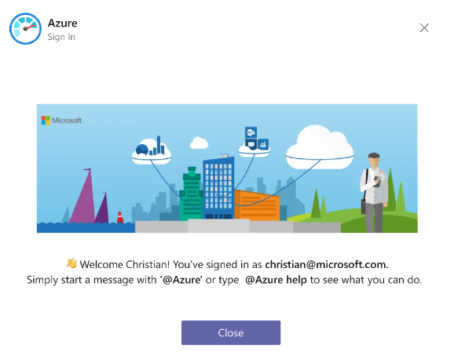
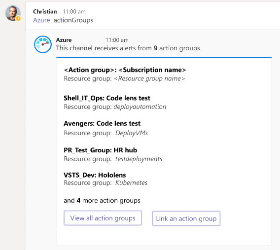
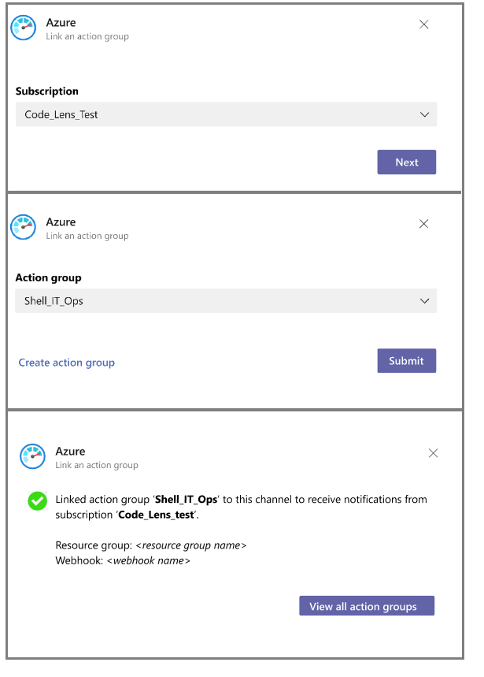
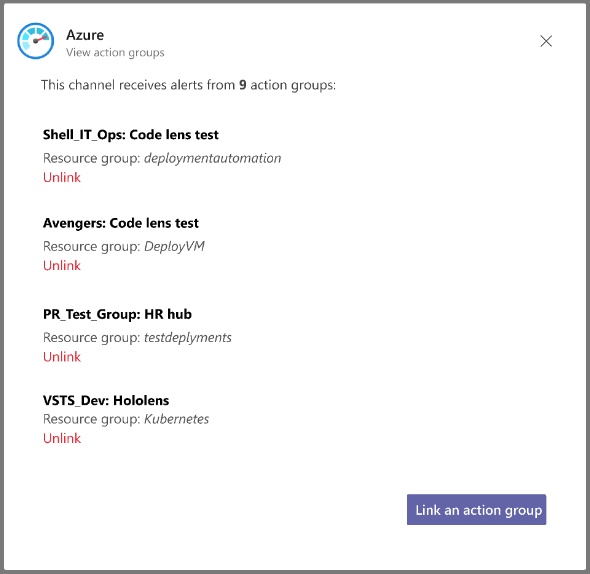
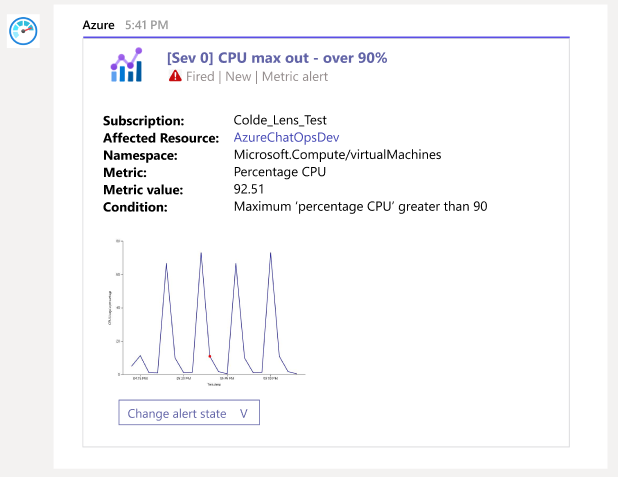

# Azure with Microsoft Teams
[Azure](https://azure.microsoft.com/) is a cloud computing service offering by Microsoft. It has over 100 services that help to build, deploy and manage applications across cloud, on-premise and at the edge. Millions of users use Azure services daily.

ChatOps is a team and collaboration centric way of working where in people, conversations, tools and files are ensembled in one place i.e. workplace messaging apps. Modern day developers spend considerable amount of time on [Microsoft Teams](https://products.office.com/microsoft-teams/group-chat-software) trying to build world class products and services. 


Today, considerable amount of time is spent to monitor applications, infrastructure and to debug issues by developers and IT operations team. This necessitates constant switching of context between Azure (get alerts, diagnose & take remedial actions) and Microsoft Teams (collaborate). Azure app for Microsoft Teams brings best of both the worlds by integrating Azure with Microsoft Teams. Users can get all the alerts from Azure in their Teams channel by linking their channel to an action group on Azure. 

## Prerequisites & limitations
Being a private preview, Azure app has certain limitations as detailed below. We will continue to invest in the app to remove some of these constraints.

> [!NOTE]
> * The app posts notifications for metric alerts. Support for 'activity log' and 'log alerts' will added soon.
> * Alerts with multiple conditions or a single metric alert with multiple dimensions are not supported.
> * Need to add a point on user id in ADO. WIll have to frame accordingly. 


## Add the Azure app to your team
Download the [manifest](https://google.com) and upload it as a custom app and install it in the team of your choice. 
> 

Upon installing, a welcome message is displayed as shown in the following image. Use the ``@azure`` handle to start interacting with the app.
> 


## Signin to your app

Once the app is installed in your team, authenticate yourself to Azure app using the ``@azure signin`` command.

> 
> 
> 


## Link your channel to action groups 
Azure uses action groups to send notifications about applications and infrastructure to users. Action groups help users to configure the medium (SMS, Email, Voice, Mobile app, Webhooks, etc) through which they want to get notified on. Every alert on Azure is mapped to one or more action groups. Azure app for Microsoft Teams allows users to link to action groups of their choice and get notified on the alerts.

1. To view, link and unlink actions groups for a channel, use the following command:

  ```
   @azure actionGroups
  ```
  The `actionGroups` command lists all the action groups linked to a channel. 

> 

2. Click on 'Link an action group' button. Select a subscription and the action group that you want to link to the channel.

> 

  To link an action group to a channel, one must be part of [Azure Monitor Contributor](https://docs.microsoft.com/en-us/azure/azure-monitor/platform/roles-permissions-security#monitoring-contributor) group. When an action group is linked to a channel, a webhook action will be created with the name MicrosoftTeams_AzureApp_<Time_stamp> for the linked action group. 

## Unlink an action group from a channel
Run `actionGroups` command. Click on 'View all action groups' and select the action group that you want to unlink.

> 

To unlink an action group, one must be part of Azure Monitor Contributor group. 

## Receiving notifications
Once an action group is linked to a channel, all alerts sent to the action group will be directed to the channel in the form of notifications.

> 

For metric alerts, if the user who linked the action group has access to the resource group for which the alert was sent, a time series graph would be additionally rendered.

## Command reference

The following table lists all the commands you can use in your Microsoft Teams channel.

|Command	| Functionality |
| -------------------- |----------------|
| @azure actionGroups	| View,  link or unlink action groups for a channel |
| @azure signin	| Sign in to your Azure account |
| @azure signout	| Sign out from your Azure account |
| @azure feedback	| Report a problem or suggest a feature |


## Future work
We’re constantly at work to improve the app, and soon you’ll see new features stated below

> * Support for activity and log alerts
> * Ability to acknowledge and close an alert from the channel (change alert state)
> * Ability to get pipeline deployment data (for virtual machines only)
> * Threading of notifications

## Troubleshooting

1) For metric alerts, the cards are not enriched with time charts
- Possible cause: The user who linked the action group does not have access to the resource for which the alert was fired.


## Private preview terms and condition
PREVIEWS ARE PROVIDED "AS-IS," "WITH ALL FAULTS," AND "AS AVAILABLE," AND ARE EXCLUDED FROM THE SERVICE LEVEL AGREEMENTS AND LIMITED WARRANTY. Previews may not be covered by customer support.We may change or discontinue Previews at any time without notice. We also may choose not to release a Preview into "General Availability". Refer [this](https://azure.microsoft.com/en-us/support/legal/preview-supplemental-terms/) for more details.

