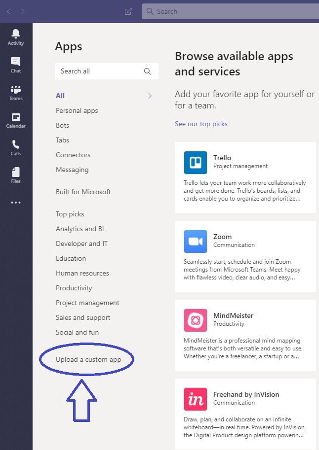
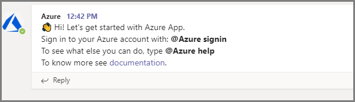
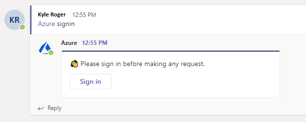
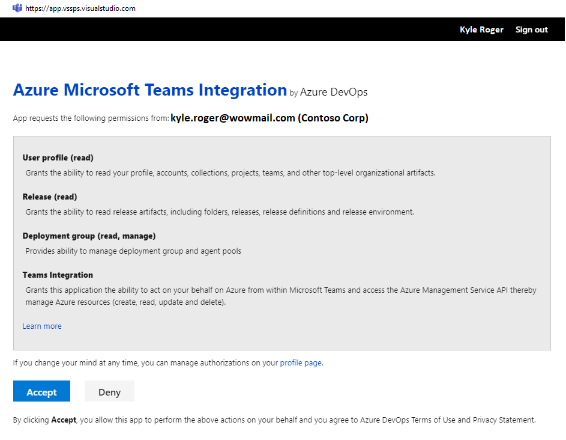
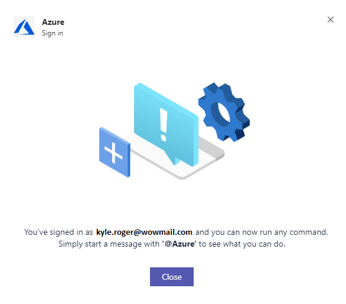

# Azure with Microsoft Teams
If you use Microsoft Teams, you can use the Azure app for Microsoft Teams to easily monitor your application and infrastructure on Azure. Link action groups of your choice with a channel and get notified on the alerts.


## Prerequisites
Being a private preview, Azure app has certain limitations as detailed below. We will continue to invest in the app to remove some of these constraints.

> [!NOTE]
> * The app posts notifications for metric alerts. Support for 'activity log' and 'log alerts' will added soon.
> * Alerts with multiple conditions or a single metric alert with multiple dimensions are not supported.
> * Need to add a point on user id in ADO. WIll have to frame accordingly. 


## Add the Azure app to your team
Download the manifest file from [here](https://google.com) and upload it as a custom app and install it to the team of your choice. 
> 

Upon installing, a welcome message is displayed as shown in the following image. Use the @azure handle to start interacting with the app.
> 


## Link the Azure app to action groups 

1. Once the app is installed in your team, authenticate yourself to Azure app using the @azure signin command.

> 
> 
> 

2. To view, link and unlink actions groups for a channel, use the following command:

  ```
   @azure actionGroups
  ```
  The `action groups` command lists all the action groups linked to the channel. It also helps users to link and unlink action groups.

> 

3. Click on 'Link an alert' button and select subscription and the action group that you want to linkt o the channel.

  ```


To link an action group to a channel, one must be part of Azure Monitor Contributor group. 

## Manage action groups


## Troubleshooting

